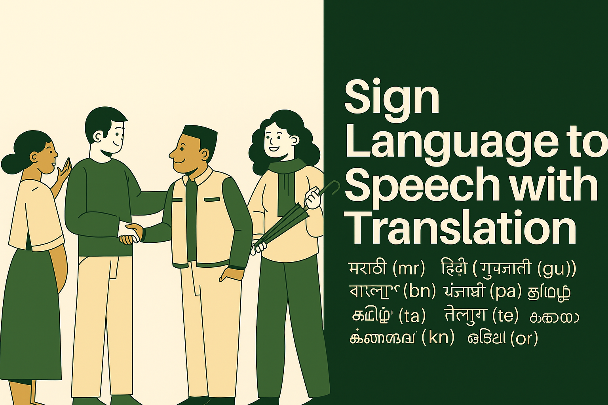

<div align="center">

[]()


<!-- [](https://github.com/RhythmusByte/Sign-Language-to-Speech) -->



<!-- [](https://opensource.org/licenses/BSD-3-Clause)
 -->

</div>

---

## 🎯 Project Overview  
**Sign Language to Speech Conversion** is a real-time **American Sign Language (ASL) recognition system** powered by **computer vision** and **deep learning**. It translates ASL hand gestures into **both text and speech output**, enhancing accessibility and communication.  

📖 For installation, architecture, usage, and contribution guidelines, visit the **[Project Wiki](https://github.com/RhythmusByte/Sign-Language-to-Speech/wiki)**.  

---

## ✨ Key Features  
- 🔮 **Real-time** hand detection & gesture tracking using MediaPipe  
- 🧠 **CNN-based** classification using TensorFlow/Keras  
- 🔊 Simultaneous **text & speech** output with customizable voices  
- 🌐 Support for multiple Indian languages including Hindi, Bengali, Telugu, and more  
- 💡 Word suggestions and spell checking for better accuracy  
- 🎯 Interactive Streamlit-based web interface  
- 📢 Designed for **accessibility & inclusivity**  

---

## 📊 System Architecture  

| Level 0 | Level 1 | Level 2 |
|---------|---------|----------|
|  |  |  |

The Data Flow Diagrams illustrate the system's architecture:
- **Level 0**: Shows the basic interaction between user and system
- **Level 1**: Breaks down the main system components and their interactions
- **Level 2**: Details the internal processes and data flow within each component

For details on **Data Flow Diagrams (DFD), Use Case Diagrams, and System Design**, check the **[Architecture Section](https://github.com/RhythmusByte/Sign-Language-to-Speech/wiki/System-Architecture-&-Design)** in the Wiki.  

---

## 🛠 Tech Stack  

### **Core Technologies**  
  
  
  

### **Supporting Libraries**  
  
  
  

---

## 📂 Repository Structure  

```text
Sign-Language-to-Speech/
├── data/            # Training data for ASL alphabets (A-Z)
├── app.py           # Main Streamlit application (renamed from Application.py)
├── Model.ipynb      # Model training notebook
├── trainedModel.h5  # Trained CNN model
├── requirements.txt # Project dependencies
├── white.jpg        # Background image
└── banner.png       # Project banner image
```

For a **detailed breakdown of modules and system design**, refer to the **[Project Documentation](https://github.com/RhythmusByte/Sign-Language-to-Speech/wiki)**.  

---

## 📢 Contributing  

We welcome contributions! Before submitting a pull request, please check out the **[Contributing Guide](https://github.com/RhythmusByte/Sign-Language-to-Speech/wiki/Contributions)**.  

---

## 🚀 Deployment

Ready to deploy your Sign Language to Speech Conversion system? Check out our detailed [Deployment Guide](DEPLOYMENT.md) for step-by-step instructions on hosting the application on Streamlit Community Cloud.

---